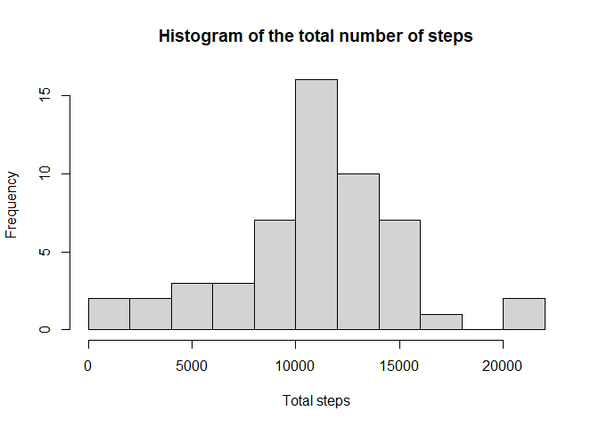
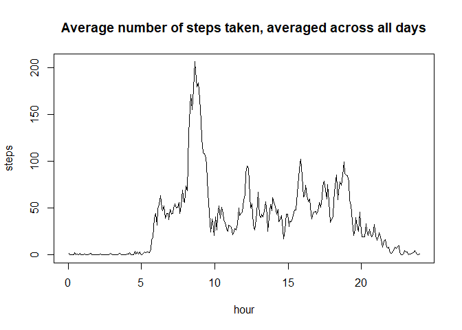
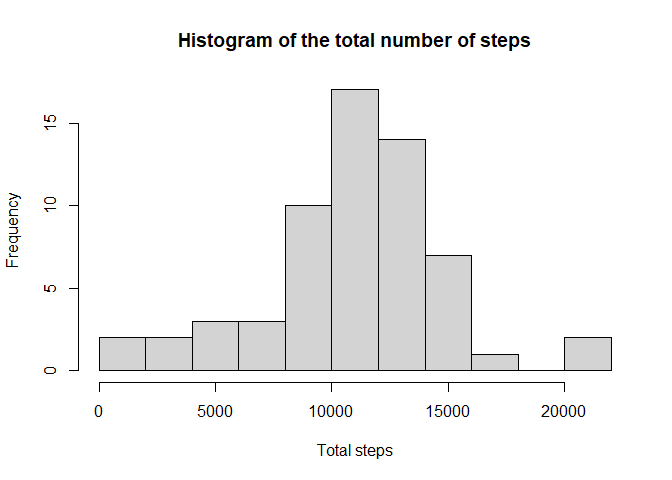
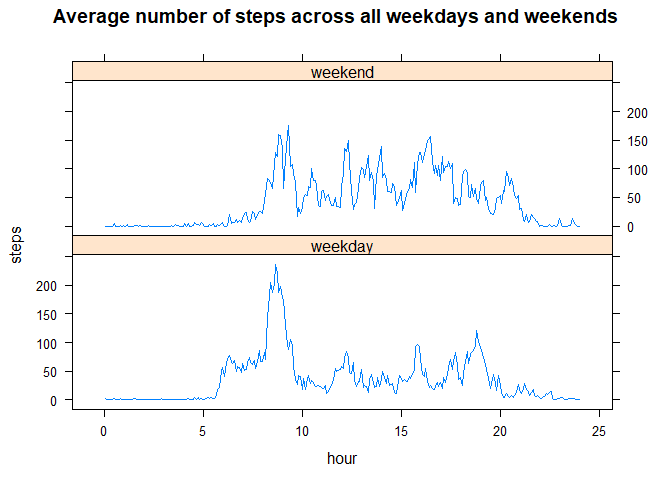

## Loading and preprocessing the data

### 1. Load the data


```r
    unzip("activity.zip")
    activity <- read.csv("activity.csv")
```


```r
    head(activity)
```

```
##   steps       date interval
## 1    NA 2012-10-01        0
## 2    NA 2012-10-01        5
## 3    NA 2012-10-01       10
## 4    NA 2012-10-01       15
## 5    NA 2012-10-01       20
## 6    NA 2012-10-01       25
```

### 2. Process the data

Converting date and interval features into POSIXct

Notes:

* Since the time zone is not specified, the time zone of GMT is selected
* The interval is converted to the number of minutes elapsed since 00:00 GMT
by the formula: interval + 2.5
(the time point that falls in the middle of the measurement interval)


```r
    library(lubridate)
```


```r
    date <- ymd(activity$date)
    
    days <- as.numeric(date)
    hours <- activity$interval %/% 100
    minutes <- activity$interval %% 100 + 2.5
    
    seconds <- 24 * 3600 * days + 3600 * hours + 60 * minutes

    activity$POSIXct <- as.POSIXct(
        seconds,
        origin = '1970-01-01',
        tz = "GMT")
    
    activity$date <- format(activity$POSIXct, "%d/%m/%Y")
    activity$interval <- NULL
    activity$time <- format(activity$POSIXct, "%H:%M:%S")
    activity$weekday <- as.integer(format(activity$POSIXct, "%u"))
```


```r
    head(activity)
```

```
##   steps       date             POSIXct     time weekday
## 1    NA 01/10/2012 2012-10-01 00:02:30 00:02:30       1
## 2    NA 01/10/2012 2012-10-01 00:07:30 00:07:30       1
## 3    NA 01/10/2012 2012-10-01 00:12:30 00:12:30       1
## 4    NA 01/10/2012 2012-10-01 00:17:30 00:17:30       1
## 5    NA 01/10/2012 2012-10-01 00:22:30 00:22:30       1
## 6    NA 01/10/2012 2012-10-01 00:27:30 00:27:30       1
```


## What is mean total number of steps taken per day?


```r
    library(dplyr)
```


```r
    day_total <- activity %>%
        group_by(date) %>%
        summarise(steps = sum(steps))
```

### 1. Histogram of the total number of steps taken each day


```r
    hist(
        day_total$steps, breaks = 10,
        main = "Histogram of the total number of steps",
        xlab = "Total steps")
```

<!-- -->

### 2. Mean and median total number of steps taken per day


```r
    summary(day_total$steps)
```

```
##    Min. 1st Qu.  Median    Mean 3rd Qu.    Max.    NA's 
##      41    8841   10765   10766   13294   21194       8
```

Conclusions:

* We can see that the median and mean values are almost the same and
  equal to 10765 and 10766;
* Additionally, we can notice that 8 days contain a NAs;
* There are also days with an extremely small total number of steps,
  the minimum value is 41 steps per day.


## What is the average daily activity pattern?

### 1. Average number of steps taken, averaged across all days.


```r
    daily <- activity %>%
        group_by(time) %>%
        summarise(pattern = mean(steps, na.rm = TRUE))
```


```r
    hour <- as.numeric(hms(daily$time)) / 3600

    plot(
        hour,
        daily$pattern,
        type = "l",
        xlim = c(0, 24),
        ylab = "steps",
        main = "Average number of steps taken, averaged across all days")
```

<!-- -->

### 2. Maximum number of steps.


```r
    summary(daily$pattern)
```

```
##    Min. 1st Qu.  Median    Mean 3rd Qu.    Max. 
##   0.000   2.486  34.113  37.383  52.835 206.170
```


```r
   print(daily$time[daily$pattern == max(daily$pattern)])
```

```
## [1] "08:37:30"
```

Conclusions:

* In the averaged data, there is an obvious pattern:
  the cycle of activity and sleep;
* The maximum number of steps in the average daily pattern is 206,
  which corresponds to the time between 08:35 and 08:40.


## Imputing missing values

### 1. Missing values


```r
    missing <- sum(is.na(activity$steps))
    total <- length(activity$steps)
    ratio <- missing / total
    
    sprintf("The number of missing values: %i (%.1f %%)", missing, ratio * 100)
```

```
## [1] "The number of missing values: 2304 (13.1 %)"
```

### 2. Devise a strategy for filling in all of the missing values in the datase

The idea of imputing is following:
    
* find average number of steps according to time and day of week
  and impute this value


```r
    impute <- activity %>%
        group_by(time, weekday) %>%
        summarise(
            steps = mean(steps, na.rm = TRUE),
            .groups = "drop")
```

Check that there are no missing values


```r
    print(sum(is.na(impute$steps)))
```

```
## [1] 0
```

So, this strategy is suitable

### 3. Imputing missing values


```r
     activity <- activity %>%
        group_by(time, weekday) %>%
        mutate(
            steps = ifelse(
                is.na(steps),
                mean(steps, na.rm = TRUE),
                steps))
```

Check that there are no missing values


```r
    missing <- sum(is.na(activity$steps))

    sprintf("The number of missing values: %i", missing)
```

```
## [1] "The number of missing values: 0"
```


```r
    head(activity)
```

```
## # A tibble: 6 x 5
## # Groups:   time, weekday [6]
##   steps date       POSIXct             time     weekday
##   <dbl> <chr>      <dttm>              <chr>      <int>
## 1  1.43 01/10/2012 2012-10-01 00:02:30 00:02:30       1
## 2  0    01/10/2012 2012-10-01 00:07:30 00:07:30       1
## 3  0    01/10/2012 2012-10-01 00:12:30 00:12:30       1
## 4  0    01/10/2012 2012-10-01 00:17:30 00:17:30       1
## 5  0    01/10/2012 2012-10-01 00:22:30 00:22:30       1
## 6  5    01/10/2012 2012-10-01 00:27:30 00:27:30       1
```

### 4. Impact of imputing missing data on the estimates
    of the total daily number of steps

#### Histogram of the total number of steps taken each day


```r
    day_total <- activity %>%
        group_by(date) %>%
        summarise(steps = sum(steps))
```


```r
    hist(
        day_total$steps,
        breaks = 10,
        main = "Histogram of the total number of steps",
        xlab = "Total steps")
```

<!-- -->

#### Mean and median total number of steps taken per day


```r
    summary(day_total$steps)
```

```
##    Min. 1st Qu.  Median    Mean 3rd Qu.    Max. 
##      41    8918   11015   10821   12811   21194
```

Conclusions:

* There are more than 13 % missing data;
* All missing values imputed by the mean value are grouped by time and
  day of the week;
* This impute strategy does not significantly affect estimates
  of the total daily number of steps: median and mean values now equal
  11015 and 10821;
* There are days with an extremely small total number of steps,
  the minimum value is 41 steps per day.


## Are there differences in activity patterns between weekdays and weekends?

### 1. Create a new factor variable in the dataset
    with two levels – “weekday”and “weekend” indicating whether
    a given date is a weekday or weekend.


```r
    activity$weekend <- cut(
        activity$weekday,
        breaks = c(1, 6, 8),
        labels = c('weekday', 'weekend'),
        right = FALSE)

    daily <- activity %>%
        group_by(time, weekend) %>%
        summarise(
            pattern = mean(steps, na.rm = TRUE),
            .groups = "drop")
```

### 2. Average number of steps taken, averaged across all weekdays and weekends.


```r
    library(lattice)
```


```r
    hour <- as.numeric(hms(daily$time)) / 3600
    xyplot(
        daily$pattern ~ hour | daily$weekend,
        type = "l",
        layout = c(1, 2),
        ylab = "steps",
        main = "Average number of steps across all weekdays and weekends")
```

<!-- -->

Conclusions:

* There are obvious difference between weekend and weekday patterns;
* You can see that on weekends, the volunteer starts the daily activity
  three hours later and finishes two hours earlier.
